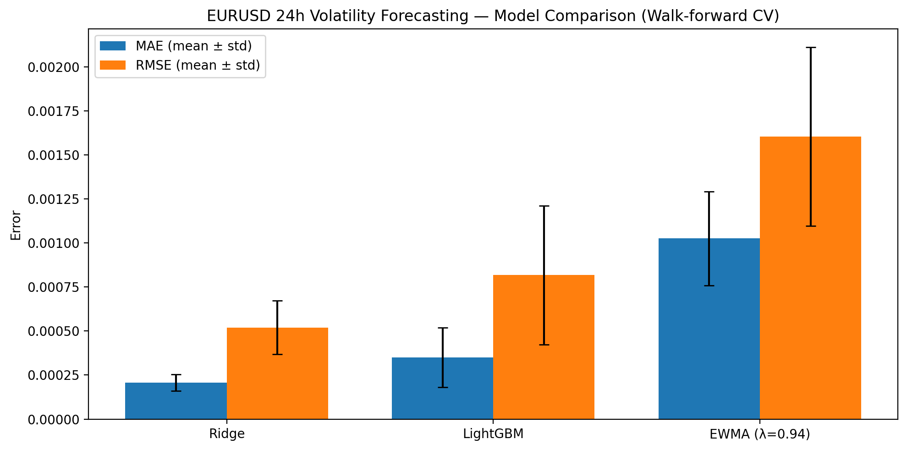
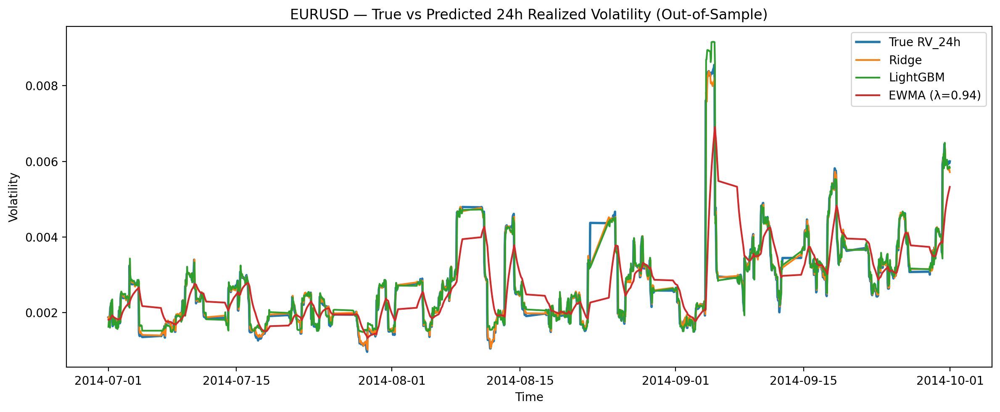

# FX Volatility Forecasting (EUR/USD, 1H)

This repository builds a clean, end-to-end workflow for forecasting **EUR/USD forward 24-hour realized volatility** using hourly (H1) data.  
It focuses on **correct target construction**, **walk-forward evaluation**, and comparing **baseline + ML models**.

---

## Project Goal

Forecast the **realized volatility over the next 24 hours** using information available up to time *t*.

This is a practical setup relevant to:
- risk management
- volatility trading / hedging
- model benchmarking under realistic time-series validation

---

## Data

- Asset: **EUR/USD**
- Frequency: **1-hour bars**
- Source: Kaggle dataset downloaded via `kagglehub`
- Note: raw data files are not pushed to GitHub (see **License & Data Publishing**).

---

## Methodology Overview

### 1) Returns
We compute 1-hour log returns:

\[
r_t = \log\left(\frac{P_t}{P_{t-1}}\right)
\]

### 2) Target: Forward 24h Realized Volatility (Notebook 02)
The prediction target at time *t* is the **forward-looking realized volatility** over the next **H = 24 hours**:

\[
RV_{t,24h} = \sqrt{24 \cdot \sum_{i=1}^{24} r_{t+i}^2}
\]

This is implemented using a forward rolling window (shifted), so the target is **strictly out-of-sample** relative to features at time *t*.

### 3) Time-series validation: Walk-forward splits (Notebook 02)
Instead of random train/test split, we use **walk-forward validation**:
- train on earlier data
- test on the next chronological block
- repeat across multiple splits

This prevents look-ahead bias and gives realistic performance estimates.

---

## Models (Notebook 03)

We evaluate multiple forecasting approaches:

### Linear Models
- **Ridge Regression**
- **ElasticNet**

These serve as strong baselines for structured features.

### Volatility Baseline
- **EWMA volatility forecast** (RiskMetrics-style)

EWMA updates conditional variance recursively:

\[
\sigma_t^2 = \lambda \sigma_{t-1}^2 + (1-\lambda) r_{t-1}^2
\]

Then the 24h volatility forecast is scaled:

\[
\hat{RV}_{t,24h} = \sqrt{24 \cdot \sigma_t^2}
\]

### Nonlinear ML
- **LightGBM** (gradient boosting)

---

## Evaluation Metrics

Models are evaluated on each walk-forward split using:

- **MAE** (mean absolute error)
- **RMSE** (root mean squared error)

Results are reported as:
- mean across splits
- std across splits

---

## Results Summary

From the final comparison table (Notebook 03):

- **Ridge** performs best among the ML models in MAE
- **LightGBM** is competitive but does not clearly beat Ridge
- **EWMA** performs worse than Ridge/LightGBM in your runs
- **ElasticNet** performs worst (likely due to too much regularization / feature scaling effects)

Important interpretation:
> Volatility is highly persistent and difficult to beat.  
> Strong baselines often match or outperform complex ML unless features/data are extremely informative.

---

## Results Visualization

### Model Comparison (MAE & RMSE)



This chart compares predictive accuracy across models, aggregated over all walk-forward splits.

---

### Volatility Forecast — Time Series Example



This plot shows a representative out-of-sample test window, comparing:
- True forward 24h realized volatility
- EWMA forecast
- Ridge regression forecast
- LightGBM forecast

It highlights volatility clustering and the relative smoothness of different models.

---

## Reproducibility

- All results are generated from Jupyter notebooks
- All plots are saved programmatically (no manual editing)
- Raw data can be re-downloaded using Notebook 01
- Processed datasets and splits are versioned

---


---

## Data Source & License

The original EUR/USD price data used in this project is distributed under the  
**Community Data License Agreement – Sharing, Version 1.0 (CDLA-Sharing-1.0)**.

- Raw market data is not included in this repository
- Only derived and processed datasets are published
- All usage complies with the license terms

License reference: https://cdla.dev/sharing-1-0/

---

## Disclaimer

This project is for **research and educational purposes only**.  
It does not constitute financial advice or a trading recommendation.

---
## Requirements

This project was developed and tested using the following Python packages:

- `numpy`
- `pandas`
- `matplotlib`
- `scikit-learn`
- `lightgbm`
- `pyarrow`
- `kagglehub`

You can install all dependencies with:

```bash
pip install -r requirements.txt

---

## Project Structure

```text
fx-volatility-forecasting/
├── notebooks/
│   ├── 01_download_data.ipynb
│   ├── 02_volatility_target_and_benchmarks.ipynb
│   └── 03_models_ridge_ewma_lightgbm.ipynb
├── data/
│   ├── raw/                 # ignored (not published)
│   └── processed/
│       ├── eurusd_h1_features.parquet
│       ├── eurusd_h1_model_table_rv24h.parquet
│       └── .....
├── plots/
│   ├── model_comparison_mae_rmse.png
│   └── volatility_forecast_timeseries.png
├── .gitignore
└── README.md
